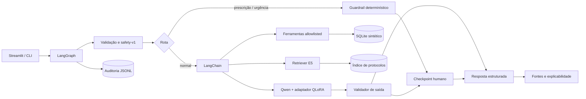

# Diagrama de arquitetura

```mermaid
flowchart LR
    UI[Streamlit / CLI] --> G[LangGraph]
    G --> V[Validação e safety-v1]
    V --> R{Rota}
    R -->|normal| LC[LangChain]
    R -->|prescrição / urgência| GR[Guardrail determinístico]
    LC --> T[Ferramentas allowlisted]
    T --> DB[(SQLite sintético)]
    LC --> RAG[Retriever E5]
    RAG --> IDX[(Índice de protocolos)]
    LC --> LLM[Qwen + adaptador QLoRA]
    LLM --> OV[Validador de saída]
    GR --> HITL[Checkpoint humano]
    OV --> HITL
    OV --> FINAL[Resposta estruturada]
    HITL --> FINAL
    G --> AUD[(Auditoria JSONL)]
    FINAL --> EXP[Fontes e explicabilidade]
```
