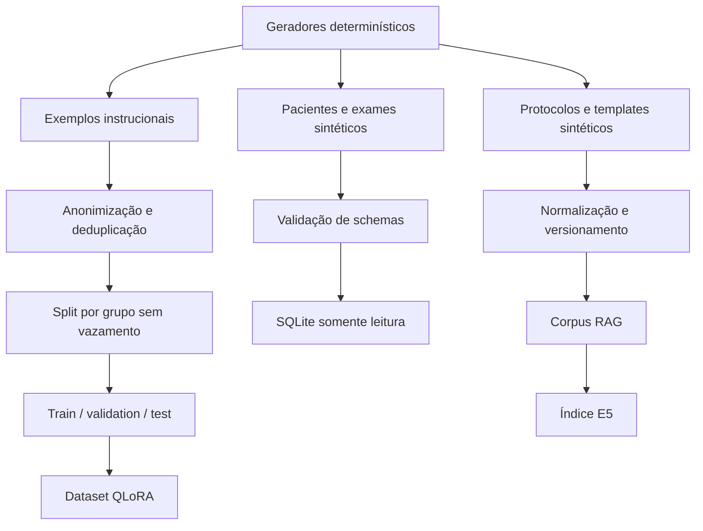

# Diagrama de preparação dos dados

```mermaid
flowchart TD
    A[Geradores determinísticos] --> B[Protocolos e templates sintéticos]
    A --> C[Pacientes e exames sintéticos]
    A --> D[Exemplos instrucionais]
    B --> E[Normalização e versionamento]
    C --> F[Validação de schemas]
    D --> G[Anonimização e deduplicação]
    E --> H[Corpus RAG]
    F --> I[SQLite somente leitura]
    G --> J[Split por grupo sem vazamento]
    J --> K[Train / validation / test]
    H --> L[Índice E5]
    K --> M[Dataset QLoRA]
```
