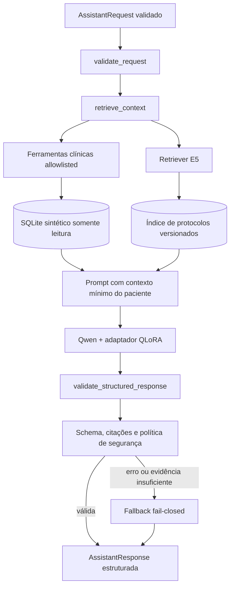

# Diagrama do fluxo LangChain

O pipeline é implementado como uma `RunnableSequence`. As consultas clínicas são
restritas a ferramentas permitidas, e as fontes finais são substituídas pelas
citações efetivamente retornadas pelo retriever.
