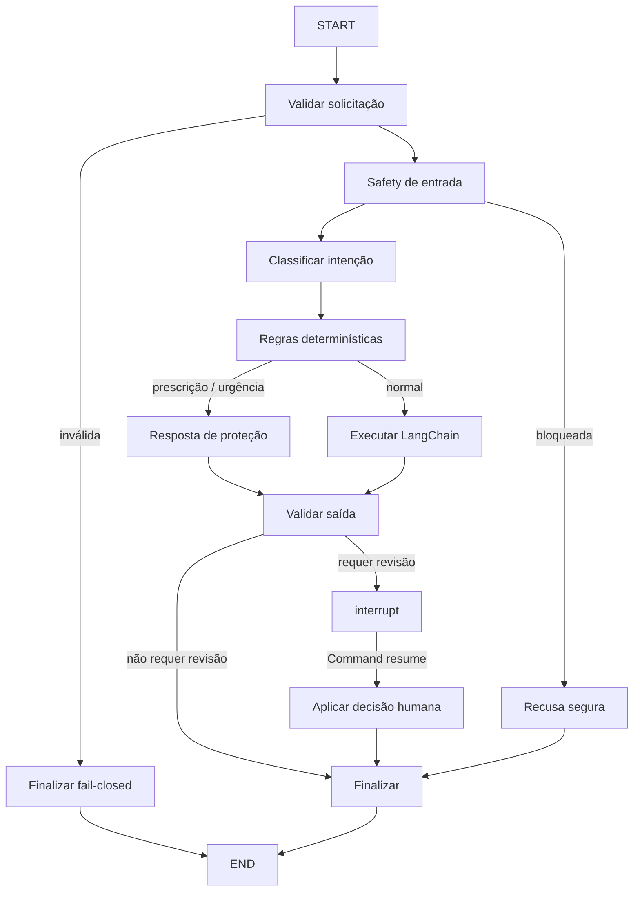

# Diagrama do LangGraph

```mermaid
flowchart TD
    START --> VALIDATE[Validar solicitação]
    VALIDATE -->|inválida| FAIL[Finalizar fail-closed]
    VALIDATE --> SCREEN[Safety de entrada]
    SCREEN -->|bloqueada| REFUSE[Recusa segura]
    SCREEN --> CLASSIFY[Classificar intenção]
    CLASSIFY --> RULES[Regras determinísticas]
    RULES -->|prescrição / urgência| GUARD[Resposta de proteção]
    RULES -->|normal| CHAIN[Executar LangChain]
    GUARD --> OUTPUT[Validar saída]
    CHAIN --> OUTPUT
    OUTPUT -->|não requer revisão| FINAL[Finalizar]
    OUTPUT -->|requer revisão| INTERRUPT[interrupt]
    INTERRUPT -->|Command resume| REVIEW[Aplicar decisão humana]
    REVIEW --> FINAL
    REFUSE --> FINAL
    FAIL --> END
    FINAL --> END
```
