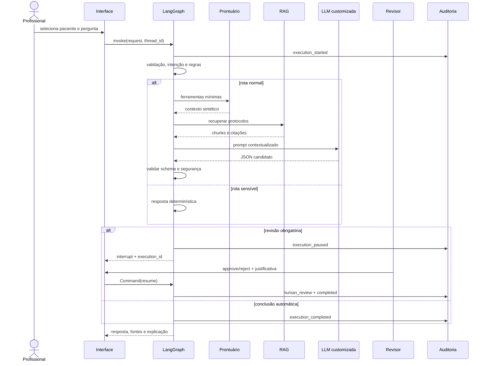

# Diagrama de sequência da consulta

```mermaid
sequenceDiagram
    actor P as Profissional
    participant UI as Interface
    participant G as LangGraph
    participant DB as Prontuário
    participant R as RAG
    participant L as LLM customizada
    participant H as Revisor
    participant A as Auditoria

    P->>UI: seleciona paciente e pergunta
    UI->>G: invoke(request, thread_id)
    G->>A: execution_started
    G->>G: validação, intenção e regras
    alt rota normal
        G->>DB: ferramentas mínimas
        DB-->>G: contexto sintético
        G->>R: recuperar protocolos
        R-->>G: chunks e citações
        G->>L: prompt contextualizado
        L-->>G: JSON candidato
        G->>G: validar schema e segurança
    else rota sensível
        G->>G: resposta determinística
    end
    alt revisão obrigatória
        G->>A: execution_paused
        G-->>UI: interrupt + execution_id
        H->>UI: approve/reject + justificativa
        UI->>G: Command(resume)
        G->>A: human_review + completed
    else conclusão automática
        G->>A: execution_completed
    end
    G-->>UI: resposta, fontes e explicação
```
