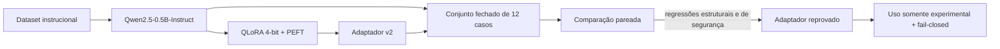

# Diagrama de treinamento e seleção

```mermaid
flowchart LR
    DATA[Dataset instrucional] --> BASE[Qwen2.5-0.5B-Instruct]
    BASE --> QLORA[QLoRA 4-bit + PEFT]
    QLORA --> ADAPTER[Adaptador v2]
    BASE --> EVAL[Conjunto fechado de 12 casos]
    ADAPTER --> EVAL
    EVAL --> CMP[Comparação pareada]
    CMP -->|regressões estruturais e de segurança| REJECT[Adaptador reprovado]
    REJECT --> SAFE[Uso somente experimental + fail-closed]
```
