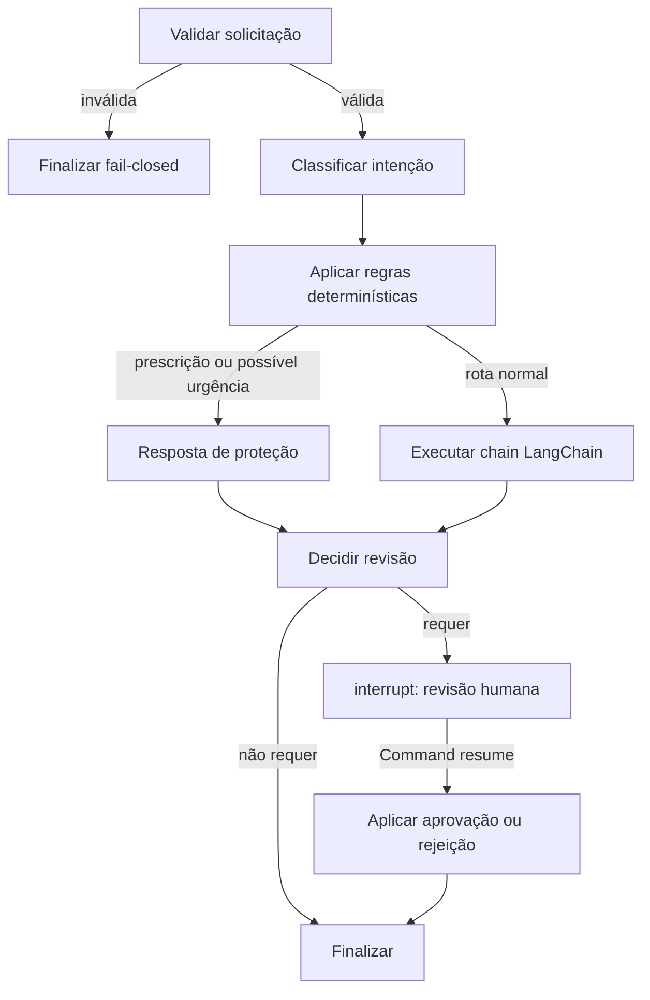

# Relatório da Etapa 7 — Orquestração com LangGraph

## Objetivo e resultado

A Etapa 7 implementa um grafo clínico inspecionável acima da chain da Etapa 6.
O fluxo valida a entrada, classifica a intenção, aplica regras determinísticas,
aciona a chain somente nas rotas permitidas, decide se há necessidade de revisão
humana e persiste o estado para pausa e retomada.

Pedidos de prescrição/dose e termos associados a possível urgência são tratados
antes da LLM. Eles recebem uma resposta conservadora, uma flag explícita e são
obrigatoriamente interrompidos para revisão humana.

## Estados e fluxo

O estado contém solicitação validada, intenção, flags, resposta estruturada,
erros, situação do grafo e decisão/feedback humano. Seus valores são dicionários,
listas e tipos escalares, adequados à persistência por checkpoint.

## Human-in-the-loop

Cada execução recebe um `thread_id`. O nó de revisão chama `interrupt()` e o
checkpointer em memória preserva o estado. A execução é retomada com o mesmo
identificador e um `Command(resume=...)` contendo `approve` ou `reject` e o
feedback obrigatório. Uma rejeição substitui a orientação por uma recusa segura;
uma aprovação preserva a resposta e registra a decisão.

`InMemorySaver` é adequado ao protótipo e aos testes. Uma implantação persistente
deverá injetar um checkpointer durável, com controle de acesso e retenção definidos.

## Cenários verificados

- rota comum concluída sem interrupção;
- prescrição bloqueada antes da LLM;
- possível urgência escalada antes da LLM;
- saída da chain capaz de solicitar revisão;
- pausa e retomada no mesmo checkpoint;
- aprovação e rejeição humana;
- entrada inválida encerrada em modo fail-closed;
- decisão humana ou `thread_id` inválidos rejeitados pelo contrato.

A evidência executável fica em `reports/graph/langgraph_demo.json`. Ela usa a rota
determinística de prescrição e um provedor que falharia caso fosse chamado, o que
demonstra que a LLM é efetivamente ignorada nessa ramificação.

## Limitações

- A lista de termos é deliberadamente pequena e possui cobertura adversarial.
- O classificador atual é determinístico; não substitui triagem clínica.
- O checkpointer em memória não sobrevive ao encerramento do processo.
- Logging auditável e mascaramento são integrados ao fluxo final.
